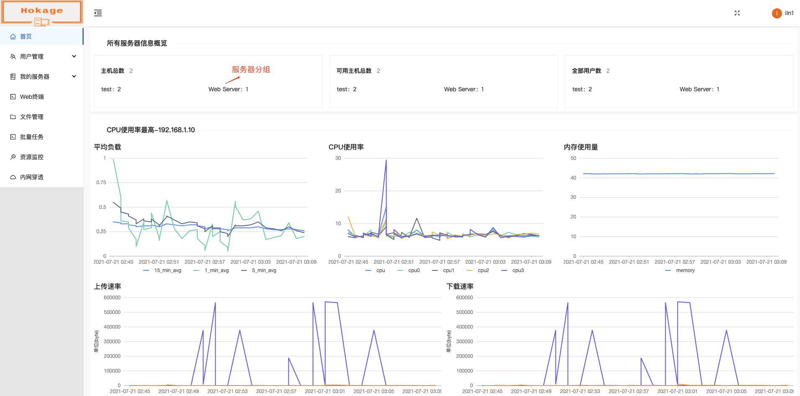
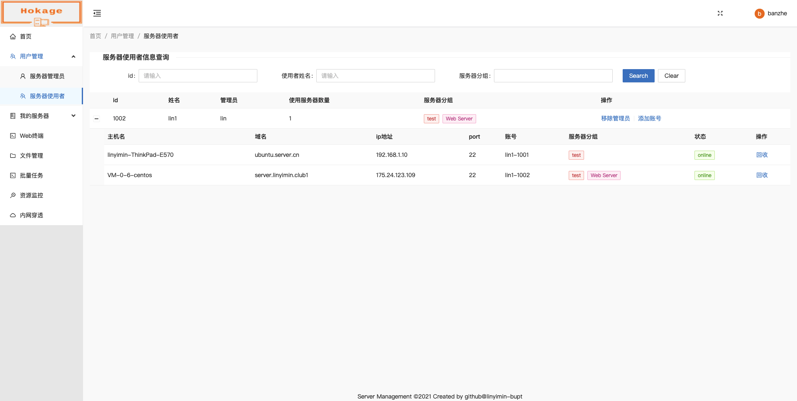
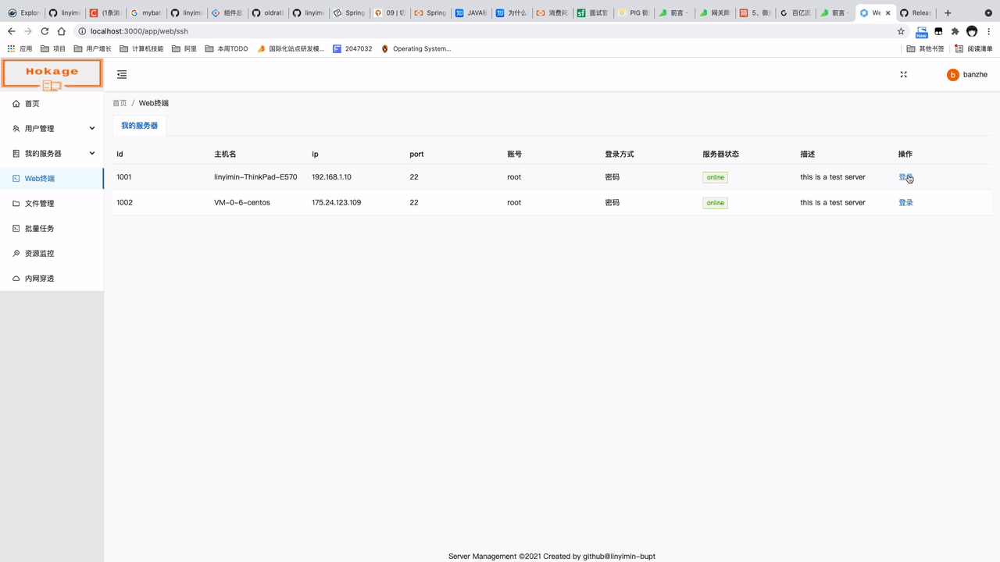
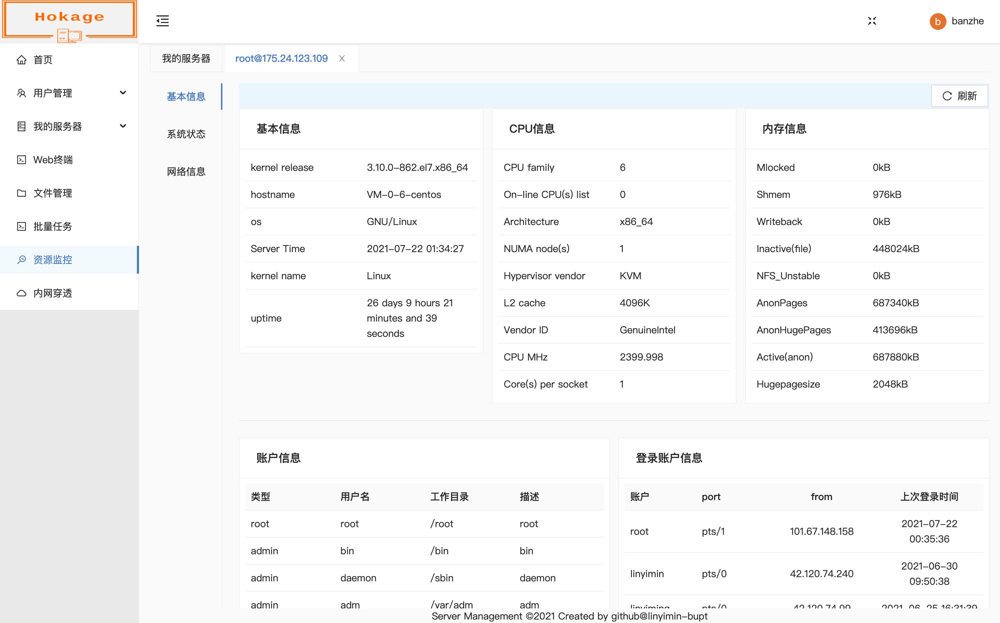
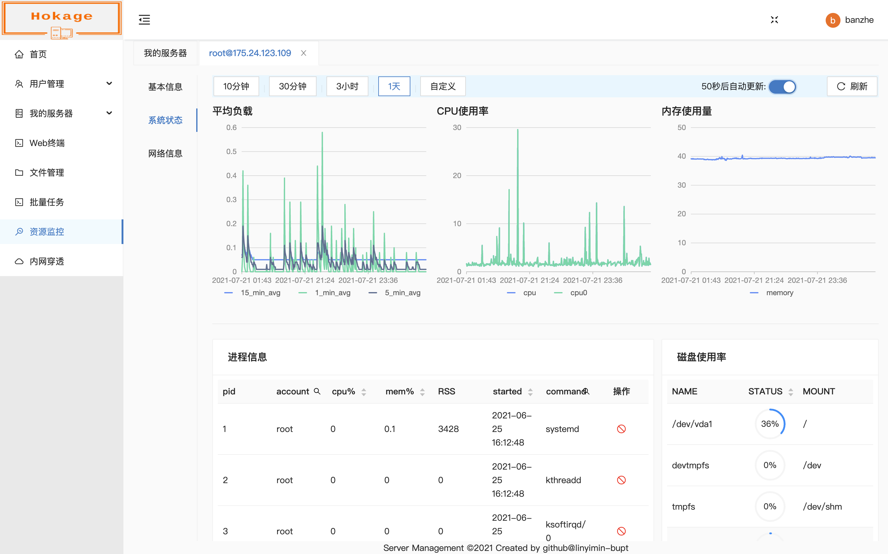
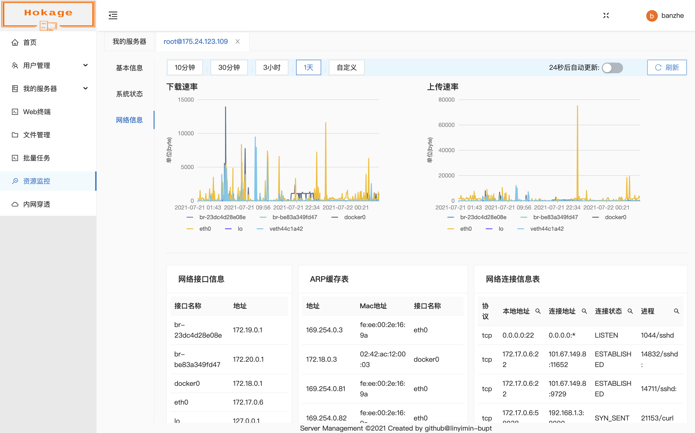

## 项目描述

本项目旨在为IP多变的小集群提供管理能力。主要能力包含用户管理、服务器管理、账号管理、Web终端、文件管理、批量任务、资源监控及IP主动上报等。



### 用户管理 
  
用户分为3个角色：超级管理员，管理员及普通用户.
 
#### 超级管理员 
负责服务器的添加，修改，删除及管理员的指定和撤销等。


#### 管理员

负责服务器的具体管理, 一键给普通用户添加账号，目前一个普通用户支持在在一台服务器创建一个账号（系统用户名+主键id），回收账号等



#### 普通用户

管理员给普通用户创建方案后，用户即可使用Web终端实现ssh远程连接服务器，文件管理，批量任务定时执行及资源监控等功能。

### Web终端




### 文件管理

文件管理支持文件列表查看、文本文件，图片及PDF文件预览、文件上传与下载、文件删除、重命名、权限修改及文件压缩等功能。


### 批量任务

批量任务目前仅支持shell脚本，指定服务器在指定时间内执行命令。


### 资源监控

资源监控包含3部分：

1. 基本信息：包含**系统信息**、**CPU信息**、**内存信息**、**账户信息**及**最近登录账号信息**
   
2. 系统状态：包含**平均负载**、**CPU使用率**、**内存使用量**、**进程信息**及**磁盘使用率**。其中进程信息和磁盘使用率是实时数据。
   平均负载、CPU使用率及内存使用量还包含历史数据。对于**进程信息**可以之间将进程kill掉(默认使用kill -9 pid)
   
3. 网络信息：包含**下载速率**、**上传速率**、**网络接口信息**、**ARP缓存表**及**网络连接信息**
   
   

   


## 环境准备

1. java 8+
2. node: 12+
3. mysql 5.6+


## 运行

1. 修改MySQL配置(application-prod.properties)

```
spring.datasource.url=jdbc:mysql://localhost:3306/hokage?createDatabaseIfNotExist=true&useSSL=false
spring.datasource.username=root
spring.datasource.password=123456
```

2. 设置profile(application.properties)

```text
spring.profiles.active=prod
```

3. 设置超级管理员(src/main/resources/mysql/data-mysql.sql)

替换插入语句中的超级管理员姓名和密码

```mysql
INSERT IGNORE INTO hokage.hokage_user (
    id,
    gmt_create,
    gmt_modified,
    username,
    passwd,
    role,
    email,
    is_subscribed
) VALUES (
    2,
    NOW(),
    NOW(),
    'admin',               # 超级管理员姓名
    '$2a$10$.b8fqqoQp8PgrO0pwU1GnegjQBjDcWSad7iFac3FmnB2UmwtlQKI2', # 密码, 使用Bcrypt加密，请在 https://www.javainuse.com/onlineBcrypt 指定生成
    100,                    # 超级管理员角色（指定为100）
    'banzhe@eaxmple.com',   # 超级管理员邮箱（用于登录）
    0                       # 是否订阅
);
```

### fat jar直接运行

4. 打包或者下载release中的jar包

```shell
mvn clean package -Ddockerfile.build.skip=true
```

5. 运行jar包

```shell
./hokage-0.0.1-SNAPSHOT
```

### docker运行

```shell
mvn clean package
docker run -d --restart=always --name hokage -p 8080:8080 hokage-0.0.1:SNAPSHOT
```


## 开发

### 启动MySQL

```shell script
docker run -itd --restart=always --name mysql -p 3306:3306 -e MYSQL_ROOT_PASSWORD=123456 mysql:5.6
```

### 前端设置代理服务端口，与服务端保持一致(config-overrides.js)

```
target: 'http://localhost:8080'
```


### 前端代码启动

```shell script
npm install
npm start
```

### swagger

```
127.0.0.1:8080/swagger-ui/index.html?url=/v3/api-docs
```


