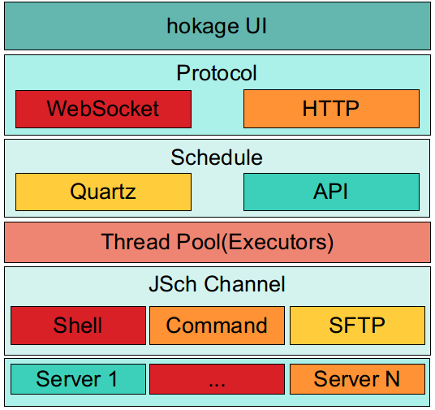
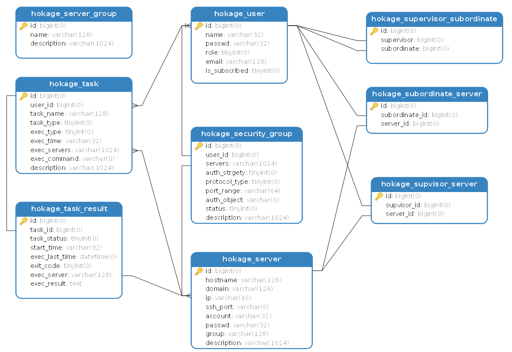

## 需要实现的功能
1. 首页
   1. 显示相关信息(申请权限,审批权限)
   2. 提交的任务完成情况
   3. 服务器状态
2. 用户管理：
   1. 总管理员
      1. 添加，修改，删除管理员
      2. 查看所有信息
         - 管理员信息
         - 管理员下所有用户信息
   2. 管理员
      1. 包含添加，修改，删除用户
      2. 添加，修改，删除用户权限
      3. 通过权限
      4. 查看用户的操作历史
3. 我的服务器
   1. 所有的服务器(所有人都可以看到,进行申请),有标签
   2. 我管理的服务器
   3. 我使用的服务器(注销)
      - IP
      - 账号
      - 密码
      - 备注
      - shell连接(Web SSH)
      - 网络管理 - 链接外网,取消外网
4. 文件管理
   动态加载(显示hostname): 查看，下载，上传，删除文件
5. 资源监控
   1. 服务器的资源使用情况,显示CPU,内存,磁盘状态,实时显示网速
   2. 进程监控: 点击进程名称可以查看进程详细信息,终止进程

6. 内网穿透




   
## 启动

```shell script
docker run -itd --restart=always --name mysql -p 3306:3306 -e MYSQL_ROOT_PASSWORD=123456 mysql:5.6
```

### use the fat jar to start

```shell script
mvn clean package -Ddockerfile.build.skip=true
cd target
./hokage-0.0.1-SNAPSHOT
```

### use docker to start

```shell script
mvn clean package
docker run -d --restart=always --name hokage -p 8080:8080 hokage-0.0.1:SNAPSHOT
```


## swagger

```
127.0.0.1:8080/swagger-ui/index.html?url=/v3/api-docs
```


